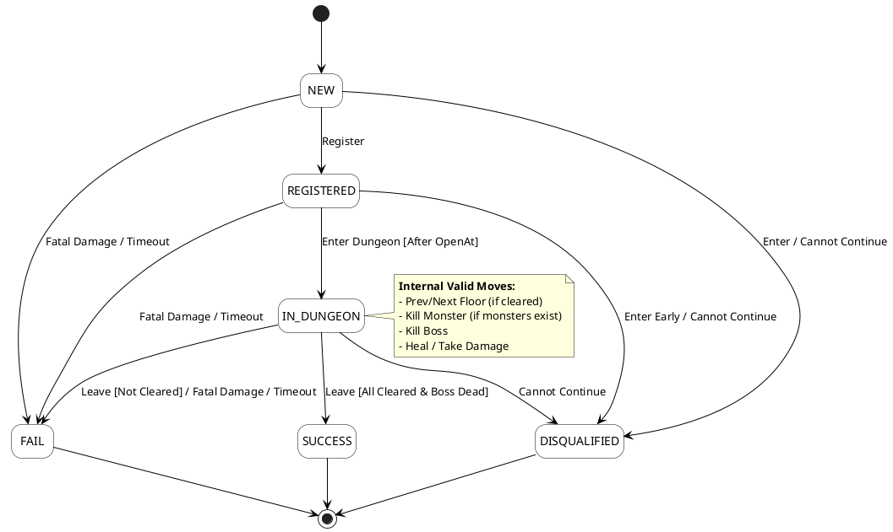

# Dungeon Challenge Processor

A robust, dependency-free event processing system for a Dungeon Challenge, built with Go 1.26.

## 📋 Table of Contents
- [Project Overview](#-project-overview)
- [Architecture & Data Flow](#-architecture--data-flow)
- [Assumptions & Edge Cases](#-assumptions--edge-cases)
- [Finite State Machine (FSM)](#-finite-state-machine-fsm)
- [State Machine Diagram](#-state-machine-diagram)
-[Extensibility: Adding New Events](#-extensibility-adding-new-events)
- [How to Run](#-how-to-run)
- [Testing](#-testing)

## 🎯 Project Overview
The system processes a sequential log of events representing players participating in a dungeon challenge. It evaluates business rules, validates state transitions, calculates time metrics, and generates a final report.

## 🏗 Architecture & Data Flow
The project strictly follows **Clean Architecture (Ports & Adapters)** principles. 

### Main Processing Loop
The orchestrator (`GameRunner` in the UseCase layer) operates in a continuous streaming loop:
1. **Read (Port):** Fetches the next raw event string using `EventReader` and parses it.
2. **Process (Domain):** Routes the incoming event to the `EventProcessor`. The processor retrieves the specific `Player` (FSM) from the Repository and calls `player.ApplyEvent(event)`.
3. **Write (Port):** The FSM returns a pure `ActionResult` (containing status and potential outgoing events). The orchestrator passes this result to the `EventWriter`.

This loop runs until `io.EOF`

## 🤔 Assumptions & Edge Cases
To maintain system integrity, the following rules and edge-case handlers were explicitly defined:
1. **Combat Restrictions:** A player can only kill a monster if they are actively on a floor, the floor is not the boss room, and there are actually monsters left. Attempting to kill a non-existent monster generates an `Impossible Move`.
2. **Movement Restrictions:** A player can only proceed to the next floor if the current floor is completely cleared of monsters. 
3. **Dungeon Closure:** If the dungeon closes (time expires) while a player is still inside, their attempt is considered a `FAIL` because they failed to extract in time.
4. **Global Damage:** A player can receive damage at any time. If health drops to 0 outside the dungeon, the player still dies and transitions to `FAIL`.

## ⚙️ Finite State Machine (FSM)
Each player is an independent FSM. Below are the transitions:

### States
1. `NEW` - Unregistered.
2. `REGISTERED` - Registered, ready to enter.
3. `IN_DUNGEON` - Actively participating.
4. `SUCCESS` - Completed all floors, killed the boss, and extracted.
5. `FAIL` - Died, timed out, or extracted early.
6. `DISQUALIFIED` - Rules violation or inability to continue.

## 📊 State Machine Diagram



## 🧩 Extensibility: Adding New Events
The system is designed to be easily extensible. To add a new event (e.g., "Player uses potion"):
1. **Domain Event ID:** Add a new constant `EventUsePotion` to the `domain.EventID` enumeration.
2. **FSM Handler:** Create a new method `usePotion(e IncomingEvent) ActionResult` in `player.go` and route it in the `ApplyEvent` switch statement.
3. **Infrastructure Writer:** Add the string mapping logic in `WriteAccepted` in `writer.go`.

Because of the architecture, adding an event requires zero changes to the core loop orchestration or repository interfaces.

## 🚀 How to Run
The project includes a `Makefile` for convenience.

```bash
# Run natively with default config.json and events
make run

# Run natively with custom files:
go run ./cmd/app/main.go -config=custom_cfg.json -events=custom_events_file.

# Run using Docker with defalt config.json and event files
make docker-run

# Run using Deocker with  files
make docker-run CONFIG=my_cfg.json EVENTS=my_events
```

## 🧪 Testing
The system is covered by both Unit Tests (Domain logic) and E2E Tests.

```bash
# Run all tests with race detector
make test
```
``` bash
# Run E2E Tests
make e2e
```